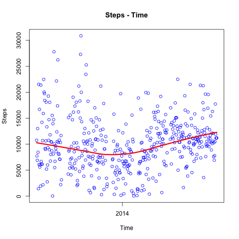

#Jawbone UP Plot
R code. 

	df = read.csv("data/jawbone.csv")

	df<-df[apply(df, 1, function(x) sum(is.na(x)))<6,]
	rownames(df)<-c(1:nrow(df))

	names(df)

	df$DATE = strptime(df$DATE, "%Y%m%d")

	plot(df$DATE,df$m_steps,xlab="Time", ylab="Steps", main="Steps - Time", col="blue")
	lines(lowess(df$DATE,df$m_steps), col="red", lwd=3)
	axis.Date(1,at=df$DATE,labels=format(df$DATE,"%m"),las=2)

	dev.copy(png,filename="images/jawbone.png");
	dev.off ();

##First step
In Python, with pandas,

	import pandas as pd

	df2013 = pd.read_csv('/Users/danielmsheehan/Dropbox/GIS/Data/	Monitoring/JawboneUp/2013.csv')
	df2014 = pd.read_csv('/Users/danielmsheehan/Dropbox/GIS/Data/	Monitoring/JawboneUp/2014.csv')

	df = df2013.append(df2014)

	df = df[['DATE','m_active_time','m_distance','m_inactive_time','m_lcat','m_lcit','m_steps']]

	df.to_csv('/Users/danielmsheehan/GitHub/jawbone/data/	jawbone.csv',index=False)